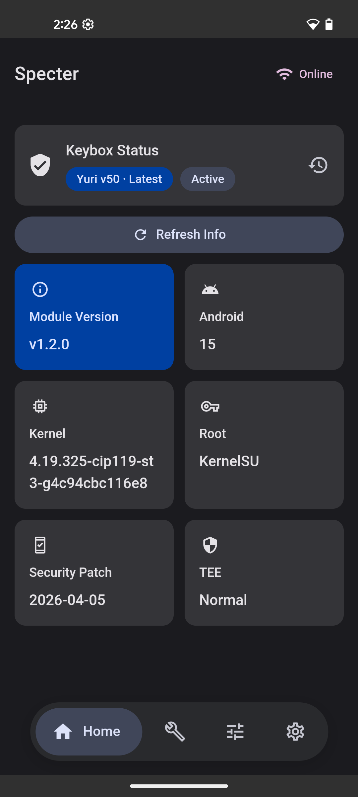
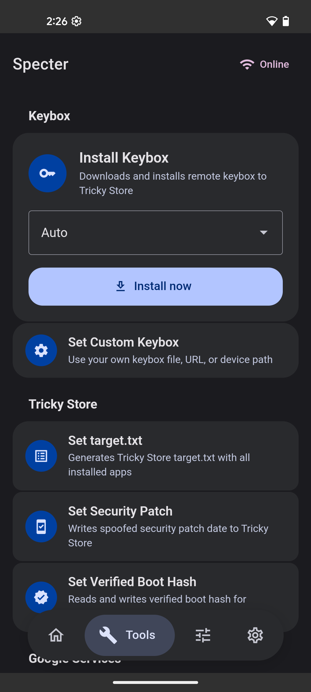
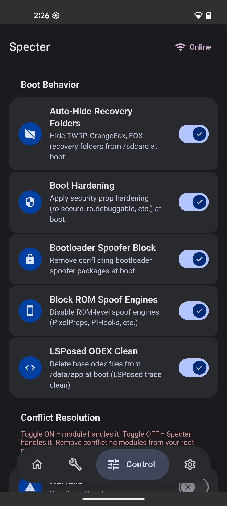
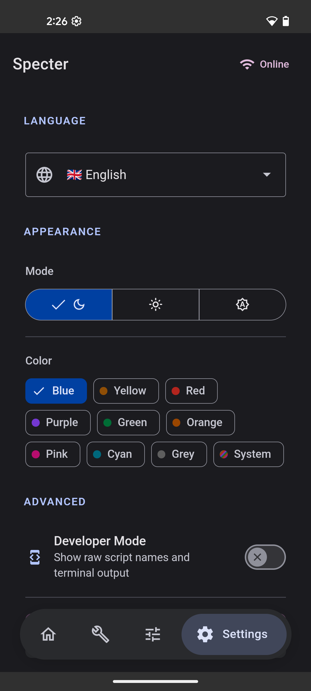

# Specter

<p align="center">
  
  
  
  
</p>

[](https://github.com/dpejoh/specter/releases/latest)

Keybox management, security spoofing, and detection avoidance — all in one module.

[Download](https://github.com/dpejoh/specter/releases/latest)

## Background

Specter is a fork of Yurikey, rewritten for clean architecture, proper error handling, and multi-source keybox support. 100% free, no paywalls, no business agenda — just a module that works.

## Support

If Specter helps you out, consider supporting the project:

- Ko-fi: [ko-fi.com/dpejoh](https://ko-fi.com/dpejoh)
- PayPal: dpejoh@atomicmail.io
- BTC: bc1qfy4vfstns4aqhvck66x0r53n3hfkkzhwkt7zpw
- ETC: 0x895762C0Fd2BeF54EE3cD478Fc03212aeA673a68

## Quick start

1. Install [Play Integrity Fix](https://github.com/KOWX712/PlayIntegrityFix/releases/latest) or [Play Integrity Fork](https://github.com/osm0sis/PlayIntegrityFork/releases/latest)
2. Install [Tricky Store](https://github.com/5ec1cff/TrickyStore/releases/latest)
3. Install Specter via Magisk / KernelSU / APatch
4. Open WebUI → Setup tab → Install a keybox

## Features

- **Keybox** — multi-source catalog, custom keybox (file/URL/path), Google revocation checking, private keybox support, backup and restore
- **Spoof** — target.txt, security patch, verified boot hash, blacklist, smartmerge, TEESimulator support
- **Maintain** — GMS kill, PIF fix, HMA-OSS / Zygisk Next / RKA configs, detection cleanup, Widevine L1
- **Settings** — theme (dark/light/auto + 9 color presets + Monet), language, dev mode with terminal, project contributors

## Requirements

- Root access (Magisk / KernelSU / APatch)
- Tricky Store
- Play Integrity Fix or Play Integrity Fork (recommended)

## Build from source

```bash
git clone https://github.com/dpejoh/specter
cd specter
npm install
npm run build
```

Output: `module.zip`

## Legal

For educational purposes only. The developer does not condone illegal activities — bypassing DRM, violating terms of service, or committing fraud. Users are solely responsible for complying with applicable laws.

## Warning

Using this software may void your warranty, cause boot loops, break apps (banking, streaming, etc.), or result in account bans. No warranty is provided. Use at your own risk. Always maintain backups of important data.

## License

GNU GPL v3.0
